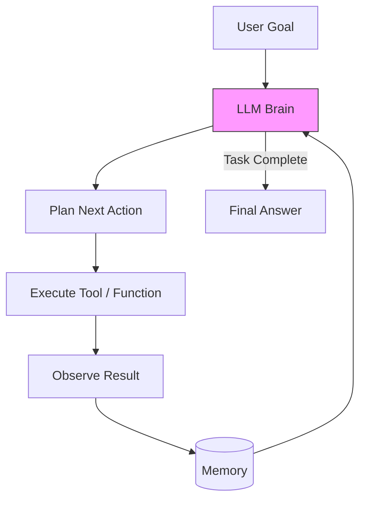

# 08 - AI Agents

> **Difficulty**: ⭐⭐⭐⭐⭐ Advanced | **Prerequisites**: 07-Retrieval-Augmented-Generation | **Estimated Reading Time**: 40 Minutes

---

## 📋 Table of Contents
1. [What Problem Does This Solve?](#1-what-problem-does-this-solve)
2. [What is an AI Agent?](#2-what-is-an-ai-agent)
3. [The Core Components of an Agent](#3-the-core-components-of-an-agent)
4. [Tool Use (Function Calling)](#4-tool-use-function-calling)
5. [Planning and Reasoning (ReAct)](#5-planning-and-reasoning-react)
6. [Reflection and Self-Correction](#6-reflection-and-self-correction)
7. [Industry Applications](#7-industry-applications)
8. [Key Takeaways](#8-key-takeaways)
9. [Next Topic](#9-next-topic)

---

# 1. What Problem Does This Solve?

Large Language Models (LLMs) and RAG systems are powerful, but they are fundamentally **Stateless Question-Answering Machines**. 

### 🟢 Beginner
If you ask ChatGPT, *"Book me a flight to Paris and cancel my afternoon meetings"*, it will politely apologize and tell you it cannot do that. It is trapped inside a chat window. It cannot click buttons, browse the live internet, or send emails on your behalf.

### 🟡 Intermediate
To solve this, we must give the LLM "hands". We must write Python functions (like `search_web()`, `send_email()`, `execute_sql()`) and allow the LLM to trigger them. 

### 🔴 Advanced
But simply giving an LLM tools is not enough. If a user asks a complex question like *"Research our competitors' Q3 earnings, summarize them, and email the report to my boss"*, the LLM cannot do that in a single generation. It must **Plan** a sequence of actions, execute step 1, read the output of step 1, realize it made a mistake, **Reflect** on its error, fix it, execute step 2, and so on. An LLM wrapped in a loop of Planning, Tool Use, and Memory is called an **AI Agent**.

---

# 2. What is an AI Agent?

An **AI Agent** is an autonomous system where an LLM is used as the "Brain" to control a loop of Perception, Reasoning, and Action.

Unlike a traditional software script where the human programmer hardcodes the `if/else` logic of what happens next, in an Agentic workflow, the *LLM itself* decides what the next step should be based on the current context.

---

# 3. The Core Components of an Agent

To build a true Agent, you must implement three distinct systems around your LLM.

1.  **Planning:** Breaking a massive, ambiguous user goal into a step-by-step logical sequence of manageable tasks.
2.  **Memory:**
    *   *Short-Term Memory:* Keeping track of what happened in the last 5 steps (usually handled by the LLM context window).
    *   *Long-Term Memory:* Remembering what the user likes over months of interaction (usually handled by a Vector Database / RAG).
3.  **Tool Use:** The actual Python APIs the agent is allowed to trigger to interact with the outside world.

---

# 4. Tool Use (Function Calling)

How does a text-generating LLM actually "click a button" or "run a script"? It uses **Function Calling**.

1.  **The System Prompt:** You inject a JSON schema into the prompt telling the LLM what tools exist.
    *   `{"name": "get_weather", "description": "Gets current weather", "parameters": {"location": "string"}}`
2.  **The LLM Decision:** Instead of generating conversational English, the LLM generates a JSON string: `{"tool": "get_weather", "location": "London"}`
3.  **The Execution:** Your Python code catches this JSON, pauses the LLM, executes `requests.get("weather.com/London")`, and gets the result: `60 Degrees`.
4.  **The Return:** You append `"Tool Output: 60 Degrees"` to the chat history and let the LLM generate its final English response: `"It is currently 60 degrees in London."`

---

# 5. Planning and Reasoning (ReAct)

The most famous framework for Agentic reasoning is **ReAct (Reason + Act)**.

Standard LLMs suffer from "Action bias"—they try to take an action before fully understanding the problem. ReAct forces the LLM to "think out loud" before it acts, drastically improving its success rate.

**The ReAct Loop Example:**
*   *User:* What is the age of the CEO of Apple multiplied by 2?
*   *Thought:* I need to find out who the CEO of Apple is, then find their age, then do math.
*   *Action:* `search_web("CEO of Apple")`
*   *Observation:* Tim Cook is the CEO of Apple.
*   *Thought:* Now I need to find Tim Cook's age.
*   *Action:* `search_web("Tim Cook age")`
*   *Observation:* Tim Cook is 63 years old.
*   *Thought:* Now I need to multiply 63 by 2. 63 * 2 = 126.
*   *Action:* `finish("126")`

By forcing the LLM to generate the `Thought` string before the `Action` string, it avoids compounding errors.

---

# 6. Reflection and Self-Correction

What happens when a tool fails?
If an Agent tries to run a SQL query and the database returns a `SyntaxError`, a naive script will crash. 

A well-designed Agent uses **Reflection**. You pass the `SyntaxError` back to the LLM with the prompt: *"Your previous action failed with this error. Think about why it failed, rewrite the SQL query, and try again."*

This allows Agents to autonomously debug their own code, fix broken URLs, and handle edge cases that a human programmer could never anticipate.

---

# 7. Industry Applications

*   **Software Engineering Agents (e.g., Devin, GitHub Copilot Workspace):** You give the Agent a Jira ticket. It reads your codebase (RAG), plans a solution, writes the code, runs the unit tests, reads the terminal errors, fixes its own bugs, and submits a Pull Request.
*   **Data Analysis Agents:** You upload an Excel file. The Agent writes Pandas code, executes it in a Python sandbox, generates matplotlib charts, and writes a PowerPoint presentation summarizing the findings.
*   **Customer Success Agents:** Not just answering questions, but actually logging into Salesforce, issuing a refund, and emailing the customer the receipt without any human intervention.

---

# 8. Key Takeaways

*   **AI Agents** are systems where an LLM is the "Brain" controlling a loop of Planning, Memory, and Tool Execution.
*   **Function Calling** allows LLMs to interact with the outside world by generating structured JSON commands instead of English text.
*   **ReAct (Reason + Act)** is a framework that forces the LLM to explicitly "Think" before it takes an Action, dramatically reducing errors in multi-step tasks.
*   **Reflection** allows Agents to view the errors of their previous actions and autonomously self-correct.

---

# 9. Next Topic

We have built a single, highly capable Agent. But a single Agent is constrained by its context window and its instructions. A software engineer is great at writing code, but terrible at QA testing their own code.

To build truly robust enterprise systems, we don't build one Agent. We build a team of them. In the next lesson, we will explore **Multi-Agent Systems**.

[← Retrieval-Augmented Generation](07-Retrieval-Augmented-Generation.md) | [Back to Index](README.md) | [Next Topic: Multi-Agent Systems →](09-Multi-Agent-Systems.md)
