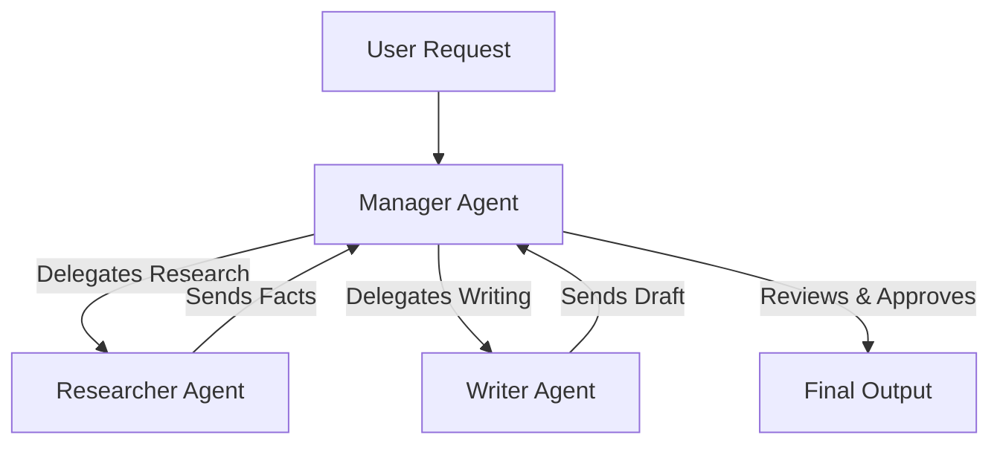

# 09 - Multi-Agent Systems

> **Difficulty**: ⭐⭐⭐⭐⭐ Advanced | **Prerequisites**: 08-AI-Agents | **Estimated Reading Time**: 30 Minutes

---

## 📋 Table of Contents
1. [What Problem Does This Solve?](#1-what-problem-does-this-solve)
2. [Why One Agent is Not Enough](#2-why-one-agent-is-not-enough)
3. [The Orchestration Pattern](#3-the-orchestration-pattern)
4. [Agent Personas and Specialization](#4-agent-personas-and-specialization)
5. [Industry Frameworks (AutoGen & CrewAI)](#5-industry-frameworks-autogen--crewai)
6. [Key Takeaways](#6-key-takeaways)
7. [Next Topic](#7-next-topic)

---

# 1. What Problem Does This Solve?

We have successfully built a single AI Agent that can use tools, browse the web, and execute Python code.

### 🟢 Beginner
If you ask a single human to design a rocket, write the software, weld the metal, and fly it to space, the human will fail. The scope is too large. 

### 🟡 Intermediate
Similarly, if you ask a single AI Agent to *"Research a new drug compound, write a 50-page scientific paper, format it for publication, and email it to the board,"* the Agent will fail. It will get confused, lose track of the context window, forget the original goal, or get stuck in an infinite error loop.

### 🔴 Advanced
To solve massive, complex, enterprise-level problems, we must build **Multi-Agent Systems (MAS)**. Instead of one monolithic AI doing everything, we instantiate a *team* of specialized AIs. One Agent writes the code, another Agent acts as a QA tester, and a third Agent acts as the Manager. They communicate with each other autonomously until the task is complete.

---

# 2. Why One Agent is Not Enough

A single LLM has a finite context window and a single system prompt.

If you give an Agent the system prompt: *"You are an expert programmer and a meticulous QA tester"*, the LLM experiences "Prompt Dilution". It doesn't know which persona to prioritize.

Furthermore, LLMs are notoriously bad at catching their own mistakes (Confirmation Bias). If an LLM writes a buggy function, and you ask that *same* LLM to review it, it will often say: *"Looks great!"*

By separating the roles, we force adversarial thinking:
*   **Agent A (The Coder):** *"I wrote this function."*
*   **Agent B (The Tester):** *"I ran your function and it failed on edge case X. Fix it."*

---

# 3. The Orchestration Pattern

In a Multi-Agent System, the Agents do not just talk over each other randomly. They follow strict communication topologies.

### The Hierarchical / Manager Pattern

1.  **The Manager:** Does not have any tools (no web search, no python execution). Its only job is to break the User Request into sub-tasks and route them to the workers.
2.  **The Workers:** Have highly specific tools. The Researcher only has `search_web()`. The Writer only has `write_to_file()`. 
3.  **The Review:** The Manager checks the Writer's draft against the Researcher's facts. If it fails, it sends it back to the Writer.

---

# 4. Agent Personas and Specialization

In MAS, every Agent is an instance of the exact same underlying LLM (e.g., GPT-4o). The only difference is their **System Prompt** and their **Tools**.

*   **The Analyst:** `Prompt: You are a cynical, detail-oriented data analyst. Do not accept assumptions. Tool: execute_sql()`
*   **The Creative:** `Prompt: You are an imaginative UX designer. Brainstorm 5 wild ideas based on the data. Tool: generate_image()`
*   **The Critic:** `Prompt: You are a harsh, critical reviewer. Your job is to find flaws in the Creative's ideas.`

By forcing these personas to debate each other, the resulting output is significantly more robust, creative, and accurate than what a single prompt could ever produce.

---

# 5. Industry Frameworks (AutoGen & CrewAI)

Building the networking code for Agents to talk to each other is tedious. The industry has developed high-level Python frameworks to handle it.

*   **Microsoft AutoGen:** A highly flexible, code-first framework. It focuses heavily on "Conversable Agents" that can natively execute code in Docker containers and engage in unconstrained back-and-forth chat until a condition is met.
*   **CrewAI:** A role-playing framework that is incredibly user-friendly. You define "Agents" (Personas), "Tasks" (The jobs), and a "Crew" (The process, e.g., Sequential or Hierarchical). It is heavily used in production for automating business workflows (like generating weekly SEO blog posts from raw data).
*   **LangGraph:** Built by LangChain, this framework treats Multi-Agent Systems as a State Machine. You explicitly draw the nodes and edges of how data flows between agents. It is excellent for highly deterministic, enterprise compliance workflows.

---

# 6. Key Takeaways

*   **Multi-Agent Systems (MAS)** solve the context and reasoning limitations of single LLMs by dividing complex work among a team of specialized AIs.
*   Separating roles (e.g., Coder vs. Tester) eliminates LLM confirmation bias and enforces rigorous quality control.
*   **Orchestration Patterns** (like the Manager-Worker hierarchy) ensure the agents stay on task and don't get stuck in infinite conversation loops.
*   Frameworks like **AutoGen, CrewAI, and LangGraph** are the modern industry standards for building these workflows in Python.

---

# 7. Next Topic

We have now built the ultimate AI system: A team of highly intelligent Agents, utilizing RAG to access private data, autonomously executing Python code to achieve enterprise goals.

But running 5 agents back-and-forth using GPT-4 costs an absolute fortune in API credits. 

How do we take these massive, expensive intelligence systems and shrink them down so they can run cheaply, quickly, and locally? In the next lesson, we will cover **Efficient AI and Model Optimization**.

[← AI Agents](08-AI-Agents.md) | [Back to Index](README.md) | [Next Topic: Efficient AI & Model Optimization →](10-Efficient_AI_And_Model_Optimization.md)
