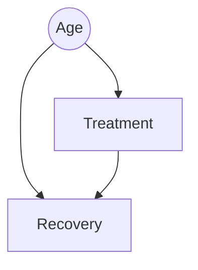

# 🔍 Causal Inference

> **Prerequisites**: Linear Regression, Probability | **Difficulty**: ⭐⭐⭐⭐☆ Advanced

---

## 📋 Table of Contents
1. [Correlation Does Not Imply Causation](#1-correlation-does-not-imply-causation)
2. [The Fundamental Problem of Causal Inference](#2-the-fundamental-problem-of-causal-inference)
3. [Confounding Variables & DAGs](#3-confounding-variables--dags)
4. [Propensity Score Matching (PSM)](#4-propensity-score-matching-psm)
5. [Difference-in-Differences (DiD)](#5-difference-in-differences-did)
6. [Library Implementation (DoWhy / CausalImpact)](#6-library-implementation-dowhy--causalimpact)
7. [Project Ideas & What's Next](#7-project-ideas--whats-next)

---

## 1. Correlation Does Not Imply Causation

A hospital notices that patients who sleep with their shoes on have a significantly higher rate of waking up with a headache compared to patients who sleep barefoot. 
A naive predictive model would learn: `Sleeping with shoes = Headache`.

But sleeping with shoes doesn't *cause* a headache. 
The hidden truth is that **drinking alcohol** causes people to fall asleep with their shoes on, and **drinking alcohol** causes headaches.

If you ban patients from sleeping with their shoes on, you will not cure their headaches.

**Machine Learning is purely associative.** A Random Forest or Deep Neural Network only finds correlations. It will confidently tell you that ice cream sales predict shark attacks (because both happen in summer).
To answer "What happens if we intervene and change X?", we need **Causal Inference**.

---

## 2. The Fundamental Problem of Causal Inference

Imagine you want to know if a new medication cures a disease.
- User 1 takes the medication ($T=1$) and recovers ($Y=1$).
- Did the medication cure them? Or were they going to recover anyway?

To know the true causal effect, we need to know what *would have happened* if User 1 didn't take the medication. This is called the **Counterfactual**.

**The Fundamental Problem**: We can never observe the counterfactual. A person cannot simultaneously take the pill and not take the pill. We must use statistical techniques to estimate the counterfactual using data from other people.

---

## 3. Confounding Variables & DAGs

A **Confounder** is a variable that influences both the Treatment (taking the pill) and the Outcome (recovering). 

For example, Age. Older people might be more likely to take the pill, but older people are also less likely to recover naturally. If we just compare the raw averages of people who took the pill vs people who didn't, the result will be completely biased by Age.

We map these relationships using **Directed Acyclic Graphs (DAGs)**.



To find the true causal effect of Treatment on Recovery, we must "block the backdoor path" flowing through Age. This is called **Controlling** or **Conditioning** on the confounder.

---

## 4. Propensity Score Matching (PSM)

If we can't run an A/B test (randomized control trial), we are left with **Observational Data**.

How do we compare people who took the pill vs people who didn't, when the groups have totally different ages, incomes, and health histories?

**Propensity Score Matching** solves this by creating a fake A/B test out of observational data.
1. Train a Logistic Regression model to predict *the probability that a person takes the pill* (the Propensity Score), using all their background variables (Age, Income, etc.).
2. For every person who actually took the pill, find a person who didn't take the pill but has the *exact same Propensity Score*.
3. Match them up into pairs. Throw away anyone who doesn't have a match.
4. Because the matched pairs have the same probability of receiving treatment, any difference in their outcomes must be caused by the treatment itself!

---

## 5. Difference-in-Differences (DiD)

What if an entire state changes its tax law, and you want to know the causal effect on employment? You can't use PSM because the entire state was treated simultaneously.

**Difference-in-Differences (DiD)** is a quasi-experimental design.
1. Find a "Control" state that did not change its tax law, but historically had similar employment trends to the "Treated" state.
2. Measure the difference in employment between the two states *before* the law.
3. Measure the difference in employment *after* the law.
4. The true causal effect is the difference between those two differences!

**The Parallel Trends Assumption**: DiD only works if we assume that, had the law never passed, the employment in the Treated state would have continued parallel to the Control state.

---

## 6. Library Implementation (DoWhy / CausalImpact)

Let's use Google's famous **CausalImpact** approach (implemented in Python via `tfcausalimpact` or `statsmodels`) to estimate the effect of an intervention over time.

Imagine we launched a massive TV marketing campaign on Day 70, and we want to know how many extra app downloads it caused.

```python
import numpy as np
import pandas as pd
from causalimpact import CausalImpact

# 1. Create simulated data (100 days)
np.random.seed(42)
x1 = np.random.normal(size=100) # Control market (e.g., Canada downloads)
y = 1.2 * x1 + np.random.normal(size=100) # Treated market (e.g., US downloads)

# At day 70, the TV campaign starts in the US, causing a true lift of +10
y[70:] += 10 

# Put into a dataframe
data = pd.DataFrame({'y': y, 'x1': x1}, columns=['y', 'x1'])

# 2. Define the Pre-Period and Post-Period
pre_period = [0, 69]
post_period = [70, 99]

# 3. Run CausalImpact
# It trains a Bayesian structural time-series model on the pre-period to predict
# the counterfactual (what the US downloads WOULD have been without the TV ad)
impact = CausalImpact(data, pre_period, post_period)

# 4. View Results
print(impact.summary())
```

*Output summary will show:*
> **Actual vs Predicted**: During the post-intervention period, the response variable had an average value of approx. 10.3. By contrast, in the absence of an intervention, we would have expected an average response of 0.5. 
> **Absolute Effect**: The causal effect of the intervention is 9.8 (which beautifully matches the true hidden lift of 10 that we injected!)

---

## 7. Project Ideas & What's Next

### Project Ideas
- 🟢 **DoWhy Library Basics**: Microsoft's `DoWhy` library is the standard for Causal Inference. Follow their official tutorial to define a Causal DAG for a simulated dataset, identify the confounders, estimate the causal effect using Linear Regression, and then "refute" the estimate by adding random common causes.
- 🟡 **Minimum Wage DiD**: Replicate the most famous economics paper in history (Card and Krueger, 1994). Download the dataset of fast-food employment in New Jersey and Pennsylvania. Use statsmodels OLS to run a Difference-in-Differences regression to prove whether raising the minimum wage caused job losses.

### What's Next
| Next | Why |
|------|-----|
| [Survival Analysis](./03-Survival-Analysis.md) | We know how to predict "Will a user churn?" (Classification). But how do we predict *exactly when* they will churn? We need to analyze time-to-event data using Survival Analysis. |

---

[← A/B Testing](01-AB-Testing.md) | [Back to Index](../README.md) | [Next: Survival Analysis →](03-Survival-Analysis.md)
