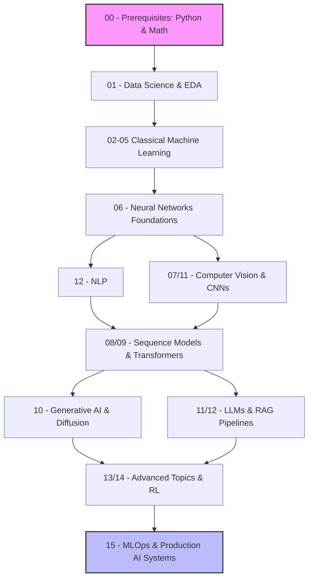

# 🚀 The Ultimate Machine Learning, DL & Data Science Roadmap
> **A world-class, comprehensive, math-heavy, and code-rich learning path taking you from absolute beginner to production-ready AI Engineer.**

Welcome to the definitive guide for mastering Machine Learning, Deep Learning, Computer Vision, NLP, LLMs, and MLOps. This repository is meticulously designed to bridge the gap between academic theory and industry-grade production AI.

### 🎯 Who is this for?
- **Self-Taught Learners** seeking a structured, step-by-step curriculum.
- **Students & Undergraduates** looking for deep mathematical intuition alongside practical code.
- **Data Scientists & ML Engineers** transitioning into Deep Learning, LLMs, and MLOps.
- **AI Researchers** who want a quick reference for foundational models and math.

### 🌟 Learning Outcomes
By the end of this roadmap, you will be able to:
- Build, train, and deploy robust ML models from scratch.
- Architect Deep Learning and Computer Vision systems using PyTorch.
- Develop advanced NLP applications using Transformers and LLMs.
- Construct production-ready RAG (Retrieval-Augmented Generation) pipelines.
- Deploy scalable AI systems utilizing modern MLOps practices.

---

## 🗺️ Visual Overview & Architecture



---

## 📅 The Learning Roadmap

A structured progression estimating **~500 Hours** of total learning.

| Stage | Topic | Difficulty | Estimated Hours | Description |
| ----- | ----- | ---------- | --------------- | ----------- |
| `00` | Prerequisites | ⭐☆☆☆☆ | 20 | Python Essentials, Linear Algebra, Probability, Calculus |
| `01` | Data Science Foundations | ⭐☆☆☆☆ | 30 | EDA, Visualization, Statistical Inference, Preprocessing |
| `02-05` | Classical ML | ⭐⭐☆☆☆ | 60 | Supervised Learning, **Unsupervised Learning (Clustering, PCA, Apriori)**, Ensembles, Evaluation |
| `06` | Neural Network Foundations | ⭐⭐⭐☆☆ | 40 | Backprop, Optimizers, PyTorch Fundamentals |
| `07` & `11` | Computer Vision | ⭐⭐⭐☆☆ | 50 | CNNs, Object Detection, Segmentation, OpenCV |
| `08` & `12` | NLP Basics | ⭐⭐⭐☆☆ | 40 | Embeddings, Text Classification, RNNs/LSTMs |
| `09` | Transformers | ⭐⭐⭐⭐☆ | 50 | Attention Mechanisms, BERT, GPT, ViT |
| `10` | Generative AI | ⭐⭐⭐⭐☆ | 40 | GANs, VAEs, Diffusion Models |
| `11` | Modern LLMs & RAG | ⭐⭐⭐⭐⭐ | 60 | Fine-Tuning, RLHF, Vector Databases |
| `13` & `14` | Advanced & Distributed | ⭐⭐⭐⭐⭐ | 50 | Reinforcement Learning, Graph Neural Networks, Big Data |
| `15` | MLOps & Production | ⭐⭐⭐⭐⭐ | 60 | Pipelines, CI/CD, Deployment, Docker, Edge ML |
| `16` | Projects | 🎓 | On-going | Applying all skills to end-to-end applications |

---

## 📂 Full Directory Structure & Module Deep Dives

Here is an in-depth look at our newly upgraded modules, such as the Data Science Foundations and Unsupervised Learning sections:

### [00-Prerequisites](./00-Prerequisites/README.md) (Absolute Beginner)
A world-class beginner-to-professional bridge course covering all core foundations before writing machine learning algorithms:
*   `01-Introduction-To-AI-Ecosystem.md` (AI vs ML vs DL vs DS, MLOps)
*   `02-Computer-Fundamentals.md` (CPU, GPU, RAM, VRAM, Filesystems, OS)
*   `03-Programming-Fundamentals.md` (Variables, Loops, Functions, OOP)
*   `04-Development-Environment-Setup.md` (Miniconda, VS Code, Jupyter, Git)
*   `05-Python-Essentials.md` (NumPy, Pandas, Matplotlib, Error Handling)
*   `06-Git-And-GitHub.md` (Version control, Branches, Merging, `.gitignore`)
*   `07-Linux-Fundamentals.md` (Terminal, File Manipulation, Process Management)
*   `08-Mathematical-Foundations.md` (Linear Algebra, Calculus, Matrices)
*   `09-Probability-And-Statistics.md` (Bayes Theorem, Probability Distributions)
*   `10-SQL-For-Data-Science.md` (Basic queries, Aggregations)
*   `projects/` (Data Analysis Starter Notebook, Git Workflow Simulation, Env Validation Script, Linux Command Toolkit)

### [01-Data-Science-Foundations](./01-Data-Science-Foundations/README.md) (Beginner → Advanced)
A complete, 16-part curriculum covering the entire data science lifecycle, from data collection to ethics:
*   `01-Introduction-To-Data-Science.md` (Lifecycle, CRISP-DM, Roles)
*   `02-Python-For-Data-Science.md` (Environments, Generators, Vectorization)
*   `03-NumPy.md` (Arrays, Broadcasting, Vectorization)
*   `04-Pandas.md` (DataFrames, GroupBy, Merging)
*   `05-Data-Collection.md` (APIs, Web Scraping, SQL connections)
*   `06-Data-Cleaning.md` (Missing values, Duplicates, Outlier Detection)
*   `07-Exploratory-Data-Analysis.md` (Univariate, Bivariate, Automated Profiling)
*   `08-Descriptive-Statistics.md` (Dispersion, Skewness, Kurtosis)
*   `09-Probability-And-Distributions.md` (Normal, Binomial, Poisson, CLT)
*   `10-Inferential-Statistics.md` (Hypothesis Testing, p-values, A/B Testing)
*   `11-Bayesian-Statistics.md` (Priors, Posteriors, Naive Bayes, MCMC)
*   `12-Data-Visualization.md` (Matplotlib, Seaborn, Plotly, Storytelling)
*   `13-Data-Preprocessing.md` (Encoding, Scaling, ML Pipelines)
*   `14-Feature-Engineering.md` (Polynomials, Binning, TF-IDF)
*   `15-SQL-For-Data-Science.md` (Aggregations, JOINs, Window Functions)
*   `16-Data-Ethics.md` (Algorithmic Bias, GDPR, Responsible AI)
*   `17-Feature-Selection.md` (Filter, Wrapper, Embedded methods)
*   `18-Imbalanced-Data.md` (Accuracy Paradox, SMOTE, Class Weights)
*   `notebooks/` (Interactive Jupyter notebooks for hands-on theory application)
*   `projects/` (5 mandatory hands-on projects including Sales Data Analysis and End-to-End EDA)

### [02-Supervised-Learning](./02-Supervised-Learning/README.md) (Beginner → Advanced)
A world-class, math-heavy, and code-rich breakdown of Supervised Machine Learning algorithms:
*   `01-Introduction-To-Supervised-Learning.md` (Workflow, Regression vs Classification)
*   `02-Linear-Regression.md` (Intuition, Math, Cost Function, Workflow)
*   `03-Polynomial-Regression.md` (Non-linear Relationships, Feature Expansion)
*   `04-Logistic-Regression.md` (Sigmoid, Binary Classification, Log Loss)
*   `05-KNN.md` (Instance-based Learning, Distance Metrics)
*   `06-Decision-Trees.md` (Entropy, Information Gain, Gini)
*   `07-Support-Vector-Machines.md` (Hyperplanes, Margins, Kernel Trick)
*   `08-Naive-Bayes.md` (Bayes Theorem, Laplace Smoothing)
*   `09-Feature-Engineering-For-Supervised-Learning.md` (Encoding, Scaling, Missing Values)
*   `10-Regularization.md` (Ridge, Lasso, ElasticNet, Overfitting)
*   `11-Model-Building-Pipeline.md` (Scikit-Learn Pipelines, Data Leakage Prevention)
*   `12-Model-Selection-Guide.md` (Algorithm selection heuristics, Bias-Variance Tradeoff)
*   `notebooks/` (Interactive Jupyter notebooks featuring From-Scratch, NumPy, and Scikit-Learn implementations)
*   `projects/` (5 hands-on projects including House Price Prediction and Spam Detection System)

### [03-Ensemble-Methods](./03-Ensemble-Methods/README.md) (Beginner → Advanced)
A complete, math-heavy, and code-rich breakdown of Ensemble Learning algorithms:
*   `01-Introduction-To-Ensemble-Learning.md` (Wisdom of Crowds, Bias-Variance)
*   `02-Bagging.md` (Bootstrap Sampling, Parallel Learning)
*   `03-Random-Forest.md` (Feature Randomness, Feature Importance)
*   `04-Extra-Trees.md` (Extremely Randomized Trees)
*   `05-Voting-Classifiers.md` (Hard vs Soft Voting)
*   `06-Boosting-Introduction.md` (Sequential Improvement)
*   `07-AdaBoost.md` (Sample Weights, Weak Learners)
*   `08-Gradient-Boosting.md` (Residual Learning)
*   `09-XGBoost-Concepts.md` (Regularization, Tree Pruning)
*   `10-LightGBM-Concepts.md` (Histogram-Based, Leaf-Wise Growth)
*   `11-CatBoost-Concepts.md` (Categorical Features, Ordered Boosting)
*   `12-Stacking.md` (Meta Learners, Cross-Validation Strategy)
*   `13-Blending.md` (Holdout-Based Ensembling)
*   `14-Model-Selection-For-Ensembles.md` (Diversity vs Performance Tradeoffs)
*   `notebooks/` (Interactive Jupyter notebooks for hands-on application)
*   `projects/` (5 mandatory projects including Customer Churn and House Price Prediction)

### [04-Unsupervised-Learning](./04-Unsupervised-Learning/README.md) (Beginner → Advanced)
A complete, math-heavy, and code-rich breakdown of Unsupervised techniques:
*   `01-Introduction-To-Unsupervised-Learning.md` (Hidden Patterns, Dimensionality)
*   `02-K-Means-Clustering.md` (Centroids, Elbow Method, Silhouette Score)
*   `03-Hierarchical-Clustering.md` (Agglomerative, Divisive, Dendrograms)
*   `04-DBSCAN.md` (Density-based, Epsilon, Noise Detection)
*   `05-Mean-Shift.md` (Kernel Density Estimation, Mode Seeking)
*   `06-Gaussian-Mixture-Models.md` (Soft Clustering, Expectation Maximization)
*   `07-Principal-Component-Analysis.md` (Variance, Eigenvectors, Derivation)
*   `08-tSNE.md` (High-Dimensional Visualization, Similarity Preservation)
*   `09-UMAP-Introduction.md` (Manifold Learning, Speed comparison)
*   `10-Association-Rule-Mining.md` (Market Basket, Support, Confidence, Lift)
*   `11-Apriori-Algorithm.md` (Frequent Itemsets, Rule Generation)
*   `12-Anomaly-Detection.md` (Statistical, Distance, Density Methods)
*   `13-Isolation-Forest.md` (Tree-Based Isolation)
*   `14-Local-Outlier-Factor.md` (Local Density Analysis)
*   `notebooks/` (Interactive Jupyter notebooks for clustering and embeddings)
*   `projects/` (6 mandatory projects including Customer Segmentation and Market Basket Analysis)

### [05-Model-Evaluation](./05-Model-Evaluation/README.md) (Beginner → Advanced)
A complete, math-heavy, and code-rich breakdown of Model Evaluation and MLOps metrics:
*   `01-Introduction-To-Model-Evaluation.md` (Why evaluate, Data Leakage)
*   `02-Train-Test-Validation-Split.md` (Holdout sets, Statistical Independence)
*   `03-Bias-Variance-Tradeoff.md` (Overfitting vs Underfitting, Math decomposition)
*   `04-Regression-Metrics.md` (MAE, MSE, RMSE, R², Adjusted R²)
*   `05-Classification-Metrics.md` (Accuracy, Precision, Recall, F1-Score)
*   `06-Confusion-Matrix.md` (TP, FP, TN, FN, Multi-class)
*   `07-ROC-And-AUC.md` (Threshold Analysis, Probabilities)
*   `08-Precision-Recall-Curves.md` (Handling extreme imbalances)
*   `09-Cross-Validation.md` (K-Fold, Stratified, LOOCV)
*   `10-Learning-Curves.md` (Diagnosing model health via data volume)
*   `11-Validation-Curves.md` (Finding optimal hyperparameters visually)
*   `12-Hyperparameter-Tuning-Evaluation.md` (Grid Search, Random Search, Bayesian Optimization)
*   `13-Imbalanced-Classification.md` (Accuracy Paradox, Balanced Accuracy)
*   `14-Model-Comparison.md` (Statistical Significance, Student's t-test)
*   `15-Production-Monitoring.md` (Data Drift, Concept Drift, MLOps)
*   `16-Interpretability-Explainability.md` (SHAP, LIME, local/global explainability)
*   `notebooks/` (Interactive Jupyter notebooks with runnable evaluation metrics)
*   `projects/` (5 mandatory projects including Hyperparameter Labs and Production Monitoring Simulators)

### [06-Neural-Networks-Foundations](./06-Neural-Networks-Foundations/README.md) (Beginner → Advanced)
A world-class, math-rich, visualization-heavy Neural Networks module covering first principles to practical implementation:
*   `01-Introduction-To-Neural-Networks.md` (Fundamental concepts, history, deep learning advantage)
*   `02-Biological-Neuron-vs-Artificial-Neuron.md` (Biological inspiration, mathematical formulation)
*   `03-Perceptron.md` (Binary classification, learning algorithm, the XOR problem)
*   `04-Multi-Layer-Perceptrons.md` (Hidden layers, universal approximation theorem, geometric transformations)
*   `05-Activation-Functions.md` (Sigmoid, Tanh, ReLU variants, Softmax)
*   `06-Forward-Propagation.md` (Matrix forms, vectorization, NumPy mechanics)
*   `07-Loss-Functions.md` (MSE, MAE, BCE, Sparse CCE, error landscapes)
*   `08-Gradient-Descent.md` (Batch, Mini-batch, Stochastic, optimization paths)
*   `09-Backpropagation.md` (The Chain Rule, computational graphs, gradient flow)
*   `10-Optimization-Algorithms.md` (Momentum, Nesterov, AdaGrad, RMSProp, Adam, AdamW)
*   `11-Weight-Initialization.md` (Xavier/Glorot, He initialization, symmetry breaking)
*   `12-Vanishing-And-Exploding-Gradients.md` (Causes, gradient clipping, ResNet connections)
*   `13-Regularization-Techniques.md` (L1/L2, Dropout, Early Stopping, Data Augmentation)
*   `14-Batch-Normalization.md` (Internal Covariate Shift, gamma and beta parameters)
*   `15-Hyperparameter-Tuning-For-Neural-Networks.md` (Learning rates, Bayesian optimization vs Grid search)
*   `16-Building-A-Neural-Network-From-Scratch.md` (Modular object-oriented pure NumPy framework)
*   `notebooks/` (6 highly visual notebooks on Activation, Loss, Backprop, Optimizers, Gradients, and Scratch NN)
*   `projects/` (MNIST Classifier, Churn Prediction, Interactive Playgrounds, Activation Visualizers, Optimization Race)

### [07-Computer-Vision-CNNs](./07-Computer-Vision-CNNs/README.md) (Beginner → Advanced)
A world-class, math-rich, visualization-heavy Computer Vision & CNN module covering first principles to advanced explanations:
*   `01-Introduction-To-Computer-Vision.md` (Human vision systems, applications)
*   `02-Images-As-Data.md` (Pixels, resolution, color spaces, RGB channels)
*   `03-Why-Traditional-ML-Struggles-With-Images.md` (High dimensionality, spatial loss, CNN comparison)
*   `04-Convolution-Operation.md` (Sliding windows, kernels, feature extraction)
*   `05-Filters-And-Feature-Maps.md` (Edge detection, blur, sharpen, Sobel filters)
*   `06-Pooling-Layers.md` (Max pooling, average pooling, dimension reduction)
*   `07-Building-The-First-CNN.md` (Input to output pipeline, simple architecture)
*   `08-CNN-Training-Pipeline.md` (Dataset prep, normalization, train/val loops)
*   `09-Activation-Functions-In-CNNs.md` (ReLU, Leaky ReLU, GELU, Softmax)
*   `10-Modern-CNN-Architectures.md` (AlexNet, VGG, ResNet, EfficientNet overview)
*   `11-Transfer-Learning.md` (Feature extraction, fine-tuning, freezing layers)
*   `12-Image-Augmentation.md` (Rotation, flipping, mixup, preventing overfitting)
*   `13-CNN-Debugging-And-Best-Practices.md` (Data leakage, class imbalance, training diagnostics)
*   `14-Visualizing-CNN-Predictions.md` (Feature maps, Saliency, Grad-CAM explainability)
*   `15-Introduction-To-Object-Detection.md` (Bounding boxes, IoU, YOLO vs Faster R-CNN)
*   `16-Introduction-To-Image-Segmentation.md` (Semantic vs Instance segmentation, U-Net)
*   `17-to-21` (Extended Topics: Padding/Strides, Backprop, CNN from Scratch)
*   `notebooks/` (CNN Fundamentals Lab, Convolution Playground, Grad-CAM Visualization)
*   `projects/` (Digit Recognition, Cat vs Dog, Plant Disease, Face Mask Web App)

### [08-Sequence-Models](./08-Sequence-Models/README.md) (Beginner → Advanced)
A world-class educational module teaching sequence modeling from first principles to modern Transformer architectures:
*   `01-Introduction-To-Sequential-Data.md` (Time series, NLP, Why order matters)
*   `02-Limitations-Of-Traditional-Neural-Networks.md` (Variable length, Context window issues)
*   `03-Recurrent-Neural-Networks-RNNs.md` (Hidden states, Memory, Sequence flow)
*   `04-RNN-Training-And-BPTT.md` (Backpropagation through time, Unfolding)
*   `05-Vanishing-And-Exploding-Gradients.md` (Long sequence degradation)
*   `06-Long-Short-Term-Memory-LSTMs.md` (Forget, Input, Output Gates)
*   `07-Gated-Recurrent-Units-GRUs.md` (Simplified memory cells)
*   `08-Attention-Mechanisms.md` (Solving long-range dependencies)
*   `09-Sequence-To-Sequence-Models.md` (Encoder-Decoder architectures)
*   `10-Transformers.md` (Self-Attention, Multi-Head, Positional Encoding)
*   `11-Modern-Transformer-Architectures.md` (BERT, GPT, T5, LLaMA)
*   `12-Time-Series-Forecasting.md` (Predicting the future)
*   `13-Sequence-Model-Evaluation.md` (BLEU, ROUGE, Perplexity)
*   `14-Common-Failure-Cases.md` (Hallucinations, Exposure Bias)
*   `15-Modern-Applications.md` (Chatbots, Speech, Translation)
*   `16-Temporal-Convolutional-Networks.md` (1D Convolutions for Sequences)
*   `notebooks/` (Attention Visualization, RNN vs LSTM, Transformer Playground)
*   `projects/` (Sentiment Analysis, Translator, Next Word Predictor, Mini-Transformer)

### [09-Transformers](./09-Transformers/README.md) (Beginner → Advanced)
A world-class educational module that bridges the gap between sequence models, attention mechanisms, and modern Large Language Models:
*   `01-Why-Transformers.md` (Sequential Bottleneck, The need for parallelization)
*   `02-Attention-Mechanism.md` (Query, Key, Value intuition)
*   `03-Self-Attention.md` (Context Awareness, Token Relationships)
*   `04-Multi-Head-Attention.md` (Learning different feature representations)
*   `05-Positional-Encoding.md` (Sinusoidal encodings, learned embeddings)
*   `06-Transformer-Architecture.md` (Encoder vs Decoder, FFN, Residuals)
*   `07-Building-A-Transformer-Step-By-Step.md` (Connecting all components)
*   `08-BERT.md` (Bidirectional context, Masked Language Modeling)
*   `09-GPT-Family.md` (Autoregressive generation, Decoder-only architecture)
*   `10-Tokenization-And_Embeddings.md` (Subwords, BPE, Word Vectors)
*   `11-Transformer-Training.md` (Pretraining, Fine-Tuning, RLHF overview)
*   `12-Prompt-Engineering.md` (Zero-shot, Few-shot, Chain-of-Thought)
*   `13-Retrieval-Augmented-Generation-RAG.md` (Embeddings, Vector DBs, Preventing Hallucinations)
*   `14-Multimodal-Transformers.md` (Vision-Language models, CLIP)
*   `15-Vision-Transformers-ViT.md` (Image patches, CNN replacements)
*   `16-Modern-Foundation-Models.md` (LLaMA, Gemini, Open Source scaling)
*   `notebooks/` (Attention Visualizer, Self-Attention Playground, Transformer From Scratch)
*   `projects/` (BERT Classifier, GPT Text Gen, RAG Assistant, Mini-Transformer Framework)

### [10-Generative-AI](./10-Generative-AI/README.md) (Beginner → Advanced)
A world-class educational module taking you from the mathematics of probability to autonomous AI agents:
*   `01-Introduction-To-Generative-AI.md` (Discriminative vs Generative)
*   `02-Probability-And_Generative_Modeling.md` (Maximum Likelihood, Distributions)
*   `03-Autoencoders.md` (Compressing reality into Latent Spaces)
*   `04-Variational-Autoencoders-VAEs.md` (Reparameterization Trick)
*   `05-Generative-Adversarial-Networks-GANs.md` (Minimax game)
*   `06-GAN-Variants.md` (DCGAN, cGAN, CycleGAN, StyleGAN)
*   `07-Image-Generation-With-GANs.md` (Data Augmentation, Style Transfer)
*   `08-Diffusion-Models.md` (Forward noise and Reverse denoising, U-Nets)
*   `09-Stable-Diffusion.md` (Latent Diffusion, Cross-Attention Text Conditioning)
*   `10-Transformers-In-Generative-AI.md` (Self-Attention, Autoregressive)
*   `11-Large-Language-Models.md` (Scaling Laws, Foundation Models)
*   `12-Prompt-Engineering.md` (Zero-shot, Few-shot, Chain of Thought)
*   `13-RAG-And_Knowledge_Augmentation.md` (Vector Databases, Hallucinations)
*   `14-Multimodal-Generative-AI.md` (Vision, Audio, Text fusion)
*   `15-AI-Agents-And_Tool_Use.md` (ReAct planning loops, autonomous tools)
*   `16-Responsible-Generative-AI.md` (Bias, Deepfakes, RLHF)
*   `notebooks/` (Labs for GANs, Diffusion, Latent Spaces, and RAG pipelines)
*   `projects/` (10 Capstone Projects including AI Agents and Stable Diffusion)

### [11-CV](./11-CV/README.md) (Beginner → Advanced)
A complete, visual-first advanced Computer Vision module focusing on production-grade systems and detection:
*   `01-Computer-Vision-Pipeline.md` (End-to-end vision system workflows)
*   `02-Image-Preprocessing.md` (Resizing, normalization, OpenCV techniques)
*   `03-Object-Detection-Fundamentals.md` (Bounding Boxes, IoU, NMS, mAP)
*   `04-YOLO-Family.md` (YOLO evolution, one-stage detectors)
*   `05-Faster-RCNN-And-Two-Stage-Detectors.md` (RPN, Mask R-CNN)
*   `06-Image-Segmentation.md` (Semantic vs Instance Segmentation)
*   `07-UNet-And-Medical-Imaging.md` (Encoder-Decoder, Skip connections)
*   `08-Pose-Estimation.md` (MediaPipe, Skeleton tracking)
*   `09-Object-Tracking.md` (SORT, DeepSORT, ByteTrack)
*   `10-Face-Recognition.md` (Embeddings, Triplet Loss, Verification)
*   `11-OCR-Systems.md` (Text detection, Tesseract, PaddleOCR)
*   `12-Video-Analytics.md` (Real-time stream processing)
*   `13-Vision-Transformers.md` (ViT, Swin Transformers, Attention in CV)
*   `14-Multimodal-Vision.md` (CLIP, Vision-Language Models)
*   `15-Computer-Vision-In-Production.md` (ONNX, TensorRT, Edge AI deployment)
*   `16-to-19` (Extended Topics: OpenCV Masterclass, Image Generation, 3D Vision, Real-World Projects)
*   `notebooks/` (Labs for Detection, Segmentation, Tracking, OCR, ViTs, and Deployment)
*   `projects/` (Smart Parking, License Plates, Medical Seg, Retail Analytics, Surveillance Dashboard)

### [12-Natural-Language-Processing](./12-Natural-Language-Processing/README.md) (Beginner → Advanced)
A complete module teaching you how to teach a machine to read, understand, classify, translate, and generate human language:
*   `01-Introduction-To-NLP.md` (Ambiguity, Context)
*   `02-Text-Preprocessing.md` (Cleaning, Stopwords, Stemming, Lemmatization)
*   `03-Tokenization.md` (Word, Character, Subword/BPE)
*   `04-Feature-Extraction.md` (Bag of Words, N-Grams, TF-IDF)
*   `05-Word-Embeddings.md` (Word2Vec, GloVe, dense semantic spaces)
*   `06-Text-Classification.md` (Categorizing documents)
*   `07-Sentiment-Analysis.md` (Extracting emotion and polarity)
*   `08-Named-Entity-Recognition-NER.md` (IOB tagging)
*   `09-Part-Of-Speech-Tagging.md` (Dependency trees)
*   `10-Language-Models.md` (N-Grams, Autoregressive loop)
*   `11-Topic-Modeling.md` (LDA and NMF)
*   `12-Machine-Translation.md` (Rule-Based, Seq2Seq Neural)
*   `13-Question-Answering-Systems.md` (Extractive vs Abstractive)
*   `14-Text-Summarization.md` (ROUGE evaluation)
*   `15-Modern-NLP-With_Transformers.md` (Self-Attention, BERT, GPT)
*   `16-NLP-In-Production.md` (Model serving, Data Drift)
*   `notebooks/` (Labs for Embeddings, NER, Sentiment, Topic Modeling)
*   `projects/` (10 Capstone Projects including Resume Parser and Search Engine)

### [13-Advanced-AI-And-ML](./13-Advanced-AI-And-ML/README.md) (Advanced → Expert)
A world-class educational module that serves as the capstone for the entire roadmap, teaching cutting-edge modern AI systems:
*   `01-Representation-Learning.md` (Embeddings, Manifolds, Latent Space)
*   `02-Self-Supervised-Learning.md` (Contrastive Learning, SimCLR)
*   `03-Transfer-Learning-And_Foundation_Models.md` (Zero-shot, Few-shot)
*   `04-Reinforcement-Learning-Fundamentals.md` (MDPs, Q-Learning)
*   `05-Deep-Reinforcement-Learning.md` (DQN, PPO, AlphaGo)
*   `06-Multimodal-AI.md` (Vision-Language Models, CLIP)
*   `07-Retrieval-Augmented-Generation.md` (Vector DBs, RAG)
*   `08-AI-Agents.md` (Tool Use, ReAct, Function Calling)
*   `09-Multi-Agent-Systems.md` (AutoGen, CrewAI)
*   `10-Efficient_AI_And_Model_Optimization.md` (Quantization, LoRA)
*   `11-AI_Safety_And_Alignment.md` (RLHF, Jailbreaking)
*   `12-Evaluation_Of_Modern_AI_Systems.md` (LLM-as-a-Judge)
*   `13-AI_In_Production.md` (MLOps, Serving, Drift)
*   `14-Research_Papers_And_How_To_Read_Them.md` (The 3-Pass Method)
*   `15-Emerging_AI_Trends.md` (State Space Models, Mamba)
*   `16-Future_Of_AI.md` (AGI, ASI, Post-Scarcity)
*   `17-to-22` (Extended Topics: GNNs, Meta-Learning, Recommender Systems, Time-Series)
*   `notebooks/` (Labs for Contrastive Learning, RL, RAG, Agents, and Optimization)
*   `projects/` (10 Capstone Projects including a Multi-Agent Collaboration System)

### [14-Advanced-Data-Science](./14-Advanced-Data-Science/README.md) (Advanced)
A world-class advanced data science module bridging traditional analysis and modern production-grade data systems:
*   `01-Advanced-Statistics-For-Data-Science.md` (Uncertainty, Hypothesis testing, Power)
*   `02-Experimental-Design-And_AB_Testing.md` (Randomization, Treatment groups, Significance)
*   `03-Causal-Inference.md` (Confounding variables, Counterfactuals, Propensity scores)
*   `04-Time-Series-Fundamentals.md` (Trend, Seasonality, Cyclic behavior, Noise)
*   `05-Time-Series-Forecasting.md` (ARIMA, Prophet, Exponential Smoothing)
*   `06-Anomaly-Detection.md` (Statistical, ML, and DL methods)
*   `07-Recommender-Systems.md` (Content-based, Collaborative filtering, Matrix factorization)
*   `08-Customer-Analytics.md` (Segmentation, Churn, CLV, Cohort analysis)
*   `09-Marketing-And_Product_Analytics.md` (Conversion rates, Retention, Engagement)
*   `10-Big-Data-Fundamentals.md` (Volume, Velocity, Hadoop, Spark)
*   `11-Feature_Stores_And_Modern_Data_Platforms.md` (Warehouses, Lakes, Lakehouses)
*   `12-Decision_Science.md` (Expected value, Risk analysis, Scenario planning)
*   `13-Data_Product_Thinking.md` (Data product design, Examples)
*   `14-Analytics_Engineering.md` (Data modeling, ETL, ELT, dbt)
*   `15-Production_Data_Science.md` (Monitoring, Data drift, Pipelines)
*   `16-Future_Of_Data_Science.md` (AI-Augmented analytics, Decision Intelligence)
*   `17-to-19` (Extended Topics: Survival Analysis, Geospatial, Data Ethics)
*   `notebooks/` (Labs for A/B Testing, Time Series, Recommenders, Dashboards)
*   `projects/` (10 Capstone Projects including Churn Prediction and A/B Framework)

### [15-ML-In-Production](./15-ML-In-Production/README.md) (Expert)
A world-class production machine learning repository bridging the gap between training models in notebooks and serving them in enterprise-grade AI systems:
*   `01-Introduction-To_ML_Production.md` (Notebooks vs Production)
*   `02-ML_Lifecycle.md` (End-to-End lifecycle)
*   `03-MLOps_Fundamentals.md` (Reproducibility, Automation, DevOps vs MLOps)
*   `04-Data_Pipelines.md` (Batch Processing, Streaming, ETL, ELT)
*   `05-Feature_Engineering_And_Feature_Stores.md` (Offline vs Online Features)
*   `06-Model_Versioning_And_Experiment_Tracking.md` (MLflow, W&B)
*   `07-Model_Serving.md` (Batch Inference, Online Inference, APIs)
*   `08-Building_ML_APIs.md` (FastAPI)
*   `09-Containerization_With_Docker.md` (Containers, Images, Portability)
*   `10-CI_CD_For_ML.md` (Automated Testing, Continuous Deployment)
*   `11-Monitoring_And_Observability.md` (Latency, Throughput, Errors)
*   `12-Data_Drift_And_Model_Drift.md` (Data Drift, Concept Drift)
*   `13-Retraining_And_Automation.md` (When to retrain, Workflows)
*   `14-Cloud_ML_Deployment.md` (AWS, Azure, GCP Concepts)
*   `15-Production_AI_Architecture.md` (Enterprise AI Architectures)
*   `16-ML_System_Design_Case_Studies.md` (Netflix, YouTube, Uber)
*   `17-to-19` (Extended Topics: Edge ML, Distributed Training, DVC)
*   `notebooks/` (Labs for MLflow, Drift Detection, Model Serving Benchmark)
*   `projects/` (10 Capstone Projects including Monitoring Platforms and End-to-End Pipelines)

*(More directory structures will be mapped out as they are upgraded!)*

---

## ✨ Why This Repository is Different

- 🧱 **Structured Progression**: No more jumping between random tutorials. A clear A-to-Z learning path.
- 📐 **Math meets Code**: We don't skip the math. We explain it visually and then implement it from scratch in NumPy.
- 💼 **Industry-Focused**: Focuses heavily on what actually matters in modern tech (MLOps, Deployments, LLMs).
- 🛠️ **Hands-On Projects**: Move from theory to practice with carefully scoped real-world projects.
- 📝 **Cheat Sheets & Notes**: Quick reference guides for algorithms, metrics, and deep learning architectures.
- 🤝 **Open-Source Friendly**: Built by the community, for the community.

---

## 🚀 Skills You Will Gain

After completing this repository you will be able to:
- ✅ **Build ML models**: From Linear Regression to Gradient Boosting Trees and Unsupervised clustering.
- ✅ **Train Deep Learning systems**: Architect custom Neural Networks in PyTorch.
- ✅ **Build Computer Vision applications**: Implement Real-time Object Tracking and Segmentation.
- ✅ **Build NLP applications**: Sentiment Analysis, Named Entity Recognition, and Translation.
- ✅ **Use Transformers**: Master Self-Attention, BERT, and GPT architectures.
- ✅ **Build RAG systems**: Combine Vector Databases with LLMs for intelligent retrieval.
- ✅ **Deploy AI systems**: Dockerize applications and expose REST APIs using FastAPI.
- ✅ **Create production ML pipelines**: Version data with DVC and track experiments.

---

## 🛠️ Project Showcase

Applying knowledge is the fastest way to learn. Each concept is paired with an end-of-module mini-project.

| Project | Difficulty | Skills Learned |
| ------- | ---------- | -------------- |
| **Real Estate Price Predictor** | Beginner | Pandas, EDA, Feature Engineering, Random Forest |
| **Customer Segmentation Engine** | Beginner | Unsupervised Learning, K-Means |
| **Market Basket Analysis** | Beginner | Apriori, Association Rules |
| **Image Compression Pipeline** | Intermediate | PCA, Eigen-decomposition |
| **Credit Card Fraud Detection** | Intermediate | Isolation Forest, LOF, Anomaly Detection |
| **Sensor Anomaly Detection** | Intermediate | Time Series, Z-Score |
| **Dimensionality Reduction Pipeline** | Intermediate | PCA + t-SNE Pipeline |
| **Pneumonia Detection from X-Rays** | Intermediate | PyTorch, CNNs, Transfer Learning (ResNet), Medical AI |
| **Real-Time Object Tracking with YOLO** | Intermediate | Computer Vision, OpenCV, YOLOv8 |
| **FastAPI Credit Scoring Engine** | Intermediate | XGBoost, Model Deployment, REST APIs, Docker |

*(Recommended Future Projects: Multi-Modal Chatbots, Distributed Reinforcement Learning Agents, Real-time Streaming Recommendation Engines).*

---

## 📓 Interactive Notebook Showcase

Hands-on Jupyter Notebooks to explore concepts interactively:

| Notebook | Topic | Status |
| -------- | ----- | ------ |
| `Deep-Learning-From-Scratch.ipynb` | Neural Networks | ✅ Available |
| `PyTorch-Transformer-Attention.ipynb` | Transformers | ✅ Available |
| `RAG-Pipeline-Project.ipynb` | LLMs & Vector DBs | ✅ Available |

*(Planned Interactive Notebooks: Diffusion Models from Scratch, Multi-GPU Distributed Training, MLOps CI/CD pipelines).*

---

## ⚡ Quick Start & Setup Instructions

Get your environment set up in less than 2 minutes so you can start running the code examples immediately!

### 1. Clone the repository
```bash
git clone https://github.com/sandaruns2004/Full-ML-DL-CV-and-Data-Science-Roadmap.git
cd Full-ML-DL-CV-and-Data-Science-Roadmap
```

### 2. Create a virtual environment
It is highly recommended to use a virtual environment to isolate dependencies.
```bash
python -m venv venv

# On Windows:
venv\Scripts\activate

# On macOS/Linux:
source venv/bin/activate
```

### 3. Install requirements
Our `requirements.txt` is categorized by module (ML, DL, NLP, etc.). Ensure you are in the root directory:
```bash
pip install -r requirements.txt
```
*(Note: If you run into issues installing PyTorch, please visit the [PyTorch website](https://pytorch.org/get-started/locally/) for specific commands for your OS/CUDA version).*

### 4. How to Run Examples
All Python blocks inside the markdown files are completely standalone and runnable! 
You can copy-paste them into a Python script (`test.py`) or into a Jupyter Notebook cell and they will execute, generate synthetic data, train the model, and save visualizations to your local directory.

Navigation Guide: Start chronologically in the `00-Prerequisites` folder, and read through the beautifully formatted markdown files. Run any associated Jupyter notebooks in the `Jupyter Notebooks` folder when referenced.

---

## 🤝 Contributor Experience

We welcome contributions from everyone! Whether you're fixing a typo, adding a new project, or expanding a mathematical proof.

- **Contribution Guidelines**: Please read our `CONTRIBUTING.md` (coming soon) before submitting a PR.
- **Repository Standards**: Follow consistent directory structures and descriptive file naming.
- **Documentation Standards**: Use clear, concise language. Include LaTeX for mathematical formulas.
- **Pull Request Process**: Fork the repo, create a feature branch (`feat/new-notebook`), and submit a PR with a detailed description.
- **Issue Reporting**: Found a bug or have a suggestion? Open an issue using our provided templates, detailing the problem and expected behavior.

---

## ❓ FAQ

<details>
<summary><b>1. Do I need mathematics first?</b></summary>
While you can run code without math, understanding the "why" requires it. Phase 00 covers all the necessary Linear Algebra, Calculus, and Probability you will need.
</details>

<details>
<summary><b>2. Can beginners use this roadmap?</b></summary>
Absolutely. Phase 00 and 01 are specifically designed for absolute beginners. We build intuition from the ground up.
</details>

<details>
<summary><b>3. How long does it take?</b></summary>
If you study 10-15 hours a week, expect it to take around 6 to 9 months to complete thoroughly.
</details>

<details>
<summary><b>4. Which projects should I build first?</b></summary>
Start with the "Real Estate Price Predictor" in the Beginner Projects folder to master Pandas, EDA, and Scikit-Learn.
</details>

<details>
<summary><b>5. Is this enough for a job?</b></summary>
Yes. This curriculum covers more ground than most Master's degree programs, especially in MLOps and Production AI (Phase 15), which recruiters highly value.
</details>

<details>
<summary><b>6. Do I need a powerful GPU?</b></summary>
For Phases 00-05, a standard laptop is fine. For Deep Learning (Phases 06+), you can use free cloud GPUs like Google Colab or Kaggle Notebooks.
</details>

<details>
<summary><b>7. Is this curriculum updated for modern architectures?</b></summary>
Yes! The curriculum includes modern paradigms like Vision Transformers (ViT), Large Language Models (LLMs), RAG pipelines, and Diffusion models.
</details>

<details>
<summary><b>8. What programming language is used?</b></summary>
Python is the exclusive language used throughout the roadmap.
</details>

<details>
<summary><b>9. Should I learn TensorFlow or PyTorch?</b></summary>
We focus primarily on PyTorch due to its dominance in research and modern industry applications, though concepts apply to both.
</details>

<details>
<summary><b>10. How is this different from generic online courses?</b></summary>
This roadmap provides a broader, more modern scope (including MLOps and LLMs) while remaining entirely text-based and open-source.
</details>

<details>
<summary><b>11. Where do I find the datasets?</b></summary>
All datasets used are open-source and linked directly within the specific module or project file.
</details>

<details>
<summary><b>12. How do I track my progress?</b></summary>
Fork this repository and use GitHub checkmarks (`[x]`) in your own README to track your progress as you complete modules.
</details>

<details>
<summary><b>13. Do I need to memorize the code?</b></summary>
No. Focus on understanding the concepts and architecture. You will always have access to documentation in the real world.
</details>

<details>
<summary><b>14. Are there any video lectures?</b></summary>
This is a text and code-based curriculum. We recommend supplementary YouTube videos when you need a different explanation perspective.
</details>

<details>
<summary><b>15. What is MLOps and why is it included?</b></summary>
MLOps (Machine Learning Operations) is how you put models into production reliably. It's the most requested skill by employers today.
</details>

<details>
<summary><b>16. Can I contribute a new project?</b></summary>
Yes! Please review the Contributor Experience section and submit a Pull Request.
</details>

<details>
<summary><b>17. I found a typo, what should I do?</b></summary>
Please open an issue or directly submit a pull request fixing the typo. Community help is greatly appreciated!
</details>

<details>
<summary><b>18. Is there a Discord or community?</b></summary>
Currently, discussions are held in the GitHub Discussions tab of this repository.
</details>

<details>
<summary><b>19. Can I use this to teach my own class?</b></summary>
Yes, this repository is open-source. Please just provide appropriate attribution to the original repository.
</details>

<details>
<summary><b>20. What do I do after finishing the roadmap?</b></summary>
Read research papers, contribute to major open-source ML libraries (like PyTorch or HuggingFace), and build complex capstone projects.
</details>

---

## 📈 Repository Statistics


### Star History
*(Placeholder for Star History Graph)*
```html
<a href="https://star-history.com/#sandaruns2004/Full-ML-DL-CV-and-Data-Science-Roadmap&Date">
 <picture>
   <source media="(prefers-color-scheme: dark)" srcset="https://api.star-history.com/svg?repos=sandaruns2004/Full-ML-DL-CV-and-Data-Science-Roadmap&type=Date&theme=dark" />
   <source media="(prefers-color-scheme: light)" srcset="https://api.star-history.com/svg?repos=sandaruns2004/Full-ML-DL-CV-and-Data-Science-Roadmap&type=Date" />
   
 </picture>
</a>
```

### Contribution Graph
*(Placeholder for Contribution Graph - you can use tools like GitHub Profile Summary Cards or similar open source tools to render this)*

---
> **Keywords for SEO**: Machine Learning Roadmap, Deep Learning Roadmap, Data Science Roadmap, Computer Vision Roadmap, NLP Roadmap, AI Engineer Roadmap, LLM Roadmap, MLOps Roadmap, Python for AI, Artificial Intelligence Learning Path.
